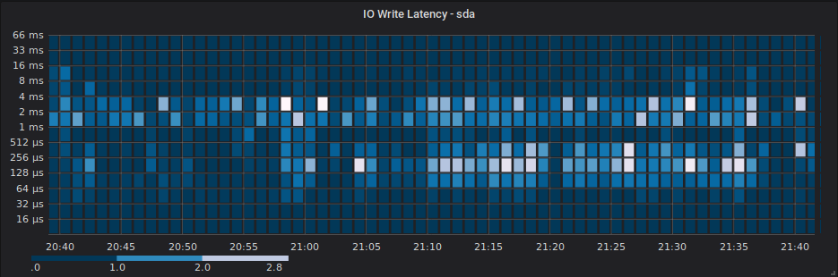

# ebpf_exporter

ebpf_exporter is an experimental Prometheus exporter which uses eBPF kprobes to efficiently record
a histogram of Linux bio request latencies and sizes.

The included BPF program is loosely based on the examples shipped with [IO Visor's BPF Compiler
Collection](https://github.com/iovisor/bcc), specifically the bitehist and disksnoop examples.

## Sample Output

Linux bio request latencies for each block device are recorded in log2 buckets separately for each
request operation type (read, write, flush, discard, etc), in microseconds. This should cover use
cases ranging from high speed flash-based devices, to legacy HDD devices.

```
# HELP ebpf_bio_req_latency A histogram of bio request latencies in microseconds.
# TYPE ebpf_bio_req_latency histogram
ebpf_bio_req_latency_bucket{device="sda",operation="write",le="1"} 0
ebpf_bio_req_latency_bucket{device="sda",operation="write",le="2"} 0
ebpf_bio_req_latency_bucket{device="sda",operation="write",le="4"} 0
ebpf_bio_req_latency_bucket{device="sda",operation="write",le="8"} 0
ebpf_bio_req_latency_bucket{device="sda",operation="write",le="16"} 0
ebpf_bio_req_latency_bucket{device="sda",operation="write",le="32"} 0
ebpf_bio_req_latency_bucket{device="sda",operation="write",le="64"} 40
ebpf_bio_req_latency_bucket{device="sda",operation="write",le="128"} 219
ebpf_bio_req_latency_bucket{device="sda",operation="write",le="256"} 335
ebpf_bio_req_latency_bucket{device="sda",operation="write",le="512"} 363
ebpf_bio_req_latency_bucket{device="sda",operation="write",le="1024"} 428
ebpf_bio_req_latency_bucket{device="sda",operation="write",le="2048"} 1649
ebpf_bio_req_latency_bucket{device="sda",operation="write",le="4096"} 3498
ebpf_bio_req_latency_bucket{device="sda",operation="write",le="8192"} 3614
ebpf_bio_req_latency_bucket{device="sda",operation="write",le="16384"} 3760
ebpf_bio_req_latency_bucket{device="sda",operation="write",le="32768"} 3777
ebpf_bio_req_latency_bucket{device="sda",operation="write",le="65536"} 3780
ebpf_bio_req_latency_bucket{device="sda",operation="write",le="131072"} 3780
ebpf_bio_req_latency_bucket{device="sda",operation="write",le="262144"} 3780
ebpf_bio_req_latency_bucket{device="sda",operation="write",le="524288"} 3780
ebpf_bio_req_latency_bucket{device="sda",operation="write",le="1.048576e+06"} 3780
ebpf_bio_req_latency_bucket{device="sda",operation="write",le="2.097152e+06"} 3780
ebpf_bio_req_latency_bucket{device="sda",operation="write",le="4.194304e+06"} 3780
ebpf_bio_req_latency_bucket{device="sda",operation="write",le="8.388608e+06"} 3780
ebpf_bio_req_latency_bucket{device="sda",operation="write",le="1.6777216e+07"} 3780
ebpf_bio_req_latency_bucket{device="sda",operation="write",le="3.3554432e+07"} 3780
ebpf_bio_req_latency_bucket{device="sda",operation="write",le="6.7108864e+07"} 3780
ebpf_bio_req_latency_bucket{device="sda",operation="write",le="1.34217728e+08"} 3780
ebpf_bio_req_latency_bucket{device="sda",operation="write",le="+Inf"} 3780
ebpf_bio_req_latency_sum{device="sda",operation="write"} 1.4306176e+07
ebpf_bio_req_latency_count{device="sda",operation="write"} 3780
```

Request sizes (in KiB) are also recorded in log2 buckets for each device:

```
# HELP ebpf_bio_req_size A histogram of bio request sizes in KiB.
# TYPE ebpf_bio_req_size histogram
ebpf_bio_req_size_bucket{device="sda",operation="write",le="1"} 8
ebpf_bio_req_size_bucket{device="sda",operation="write",le="2"} 8
ebpf_bio_req_size_bucket{device="sda",operation="write",le="4"} 2450
ebpf_bio_req_size_bucket{device="sda",operation="write",le="8"} 3050
ebpf_bio_req_size_bucket{device="sda",operation="write",le="16"} 3347
ebpf_bio_req_size_bucket{device="sda",operation="write",le="32"} 3602
ebpf_bio_req_size_bucket{device="sda",operation="write",le="64"} 3698
ebpf_bio_req_size_bucket{device="sda",operation="write",le="128"} 3714
ebpf_bio_req_size_bucket{device="sda",operation="write",le="256"} 3732
ebpf_bio_req_size_bucket{device="sda",operation="write",le="512"} 3777
ebpf_bio_req_size_bucket{device="sda",operation="write",le="1024"} 3780
ebpf_bio_req_size_bucket{device="sda",operation="write",le="2048"} 3780
ebpf_bio_req_size_bucket{device="sda",operation="write",le="4096"} 3780
ebpf_bio_req_size_bucket{device="sda",operation="write",le="8192"} 3780
ebpf_bio_req_size_bucket{device="sda",operation="write",le="16384"} 3780
ebpf_bio_req_size_bucket{device="sda",operation="write",le="32768"} 3780
ebpf_bio_req_size_bucket{device="sda",operation="write",le="+Inf"} 3780
ebpf_bio_req_size_sum{device="sda",operation="write"} 66400
ebpf_bio_req_size_count{device="sda",operation="write"} 3780
```

Note that histograms will only be exposed for devices that have actually performed IO since the BPF
program was loaded. If a device is only performing writes, no histogram will be present for reads,
and vice versa.

## Grafana Panel Samples

Grafana 5.1 and later supports Prometheus histograms, either as bar / line / point graphs, or as
heatmaps. See Grafana's [heatmap panel](http://docs.grafana.org/features/panels/heatmap/) guide for
more information.



